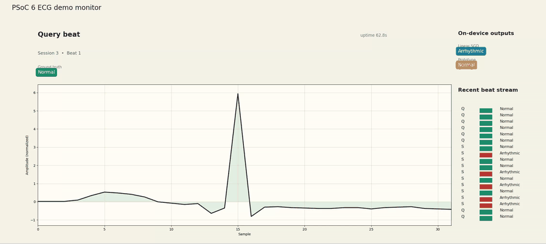
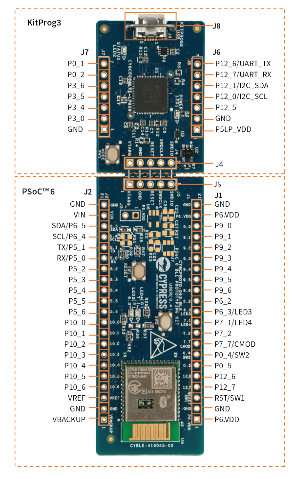

# Few-Shot Prototype Head Adaptation for On-Device ECG Personalization on PSoC~6

> **Prototype-based few-shot head adaptation for TinyML ECG classifiers — full reproduction package for the IEEE ESL submission.**

[](https://www.python.org/)
[](https://pytorch.org/)
[](LICENSE)
[](docs/PSOC6-063-BLE.md)
[-lightgrey)]()

---

## Overview

This repository accompanies the paper

> **"Few-Shot Prototype Head Adaptation for On-Device ECG Personalization on PSoC~6"**
> Guilherme SIlva, Pedro Silva, Gladston Moreira, Eduardo Luz · *IEEE Embedded Systems Letters* (submitted, 2026)

We show that a 1,314-parameter 1-D CNN backbone, trained once on the MIT-BIH DS1 split, can be personalised to a new patient via a closed-form class-mean update — **no gradient, no backward pass, no convolutional backpropagation** — while running end-to-end on a low-cost Arm Cortex-M4F prototyping board in real time. The full prototype mode uses few-shot support from both classes; the restricted mode updates only the normal prototype and requires no arrhythmia annotations.

### Key numbers at a glance

| | Pre-adapt | Linear SGD | **Prototype (ours)** |
|---|:---:|:---:|:---:|
| Macro-F1 @ K=1 | 0.635 | 0.671 | **0.731** |
| Macro-F1 @ K=5 | 0.639 | 0.704 | **0.771** |
| Macro-F1 @ K=10 | 0.646 | 0.709 | **0.797** |
| Adapt time K=1 (host) | — | 3,690 ms | **216 ms** (17× faster) |
| Adapt time K=10 (MCU) | — | 244.66 ms | **228.04 ms** |
| Flash / SRAM (model-only) | — | — | **5.2 KB / 22.2 KB** |

**Restricted variant** — adapts only the normal-beat prototype from passively buffered sinus beats (no arrhythmia annotation required):

| K | Pre F1 | Restricted (normal-only) | Full proto |
|---|:---:|:---:|:---:|
| 1 | 0.636 | 0.681 (+0.045) | 0.731 |
| 5 | 0.639 | 0.688 (+0.049) | 0.771 |
| 10 | 0.649 | 0.699 (+0.050) | 0.797 |

---

## Demo Video

The `ecgDEMO` firmware streams live beat classifications over UART while the host-side UI (`ui/demo_ecg_monitor.py`) renders the ECG waveform, support beats, and real-time `SGD` / `Prototype` decisions side by side.



**Demo video:** [Open `docs/video.webm`](docs/video.webm)

If GitHub does not play the repository-hosted video inline in your browser, use the direct file link above to open or download it.

---

## Hardware Platform

### CY8CPROTO-063-BLE



| Property | Value |
|---|---|
| MCU | PSoC 63 BLE (CYBLE-416045-02) |
| Application core | Arm Cortex-M4F @ up to 150 MHz (benchmarked at **100 MHz**) |
| Supervisory core | Arm Cortex-M0+ @ up to 100 MHz |
| Flash | 1 MB |
| SRAM | 288 KB |
| Connectivity | Bluetooth LE 5.0 |
| Programmer / Debugger | KitProg3 (SWD + USB-UART via J10) |
| UART pins used | P5_0 (TX) / P5_1 (RX) @ 115 200 baud |
| Cost (approximate) | ~$5 USD |

The complete board user guide is in [`docs/PSOC6-063-BLE.md`](docs/PSOC6-063-BLE.md). Build and flash instructions are in [`firmware/psoc6/README.md`](firmware/psoc6/README.md).

---

## Repository Structure

```
.
├── configs/                   # YAML configs for dataset, model, training, personalisation
│   ├── dataset/mitbih_binary.yaml
│   ├── model/cnn1d_tiny.yaml          # 1,314-param backbone (paper target)
│   ├── model/cnn1d_medium.yaml        # 2,618-param (scaling study)
│   ├── model/cnn1d_large.yaml         # 4,930-param (scaling study)
│   ├── training/baseline.yaml
│   └── personalization/protocol_{1,5,10}shot.yaml
├── src/
│   ├── dataset/               # MIT-BIH loading, beat extraction, DS1/DS2 splits
│   ├── models/                # CNN1D backbone, linear head, prototype head
│   ├── personalization/       # Prototype update, linear SGD, restricted variant
│   ├── training/              # Trainer, metrics, losses
│   ├── evaluation/            # Offline and embedded evaluators
│   └── export/                # C-header export, TFLite, replay packager
├── scripts/
│   ├── download_mitbih.py     # Step 1 — download raw data from PhysioNet
│   ├── prepare_dataset.py     # Step 2 — segment & normalise beats
│   ├── train_backbone.py      # Step 3 — train backbone + head
│   ├── evaluate_pre_adaptation.py    # Step 4a — baseline (no adapt)
│   ├── export_model.py        # Step 5 — export C headers
│   ├── export_replay_support.py      # Step 6 — export firmware episodes
│   ├── run_all_offline.sh     # One-shot full offline pipeline
│   ├── run_architecture_sweep.py     # Scaling study (tiny/medium/large)
│   ├── run_head_adaptation_retune.py # Head-retuning sweep (medium/large)
│   └── evaluate_restricted_prototype.py   # Restricted-variant ablation
├── firmware/
│   └── psoc6/
│       ├── app/               # Application-layer C source (demo + benchmark modes)
│       ├── common/            # Backbone runtime, personalisation, DWT profiling
│       ├── generated/         # Exported model headers (model_params.h, head_*.h)
│       ├── mtb/               # ModusToolbox workspace (libs fetched with make getlibs)
│       └── Makefile
├── paper/
│   ├── main-reduced.tex       # 4-page IEEE ESL submission (self-contained)
│   ├── refs.bib
│   ├── figures/               # All paper figures (PDF + PNG)
│   └── tables/                # All paper tables (LaTeX source)
├── results/
│   ├── offline/               # JSON results from offline evaluation scripts
│   ├── architecture_sweep/    # Scaling study JSON results
│   ├── head_retune/           # Head-retuning results for medium/large backbones
│   └── firmware/              # On-device batch benchmark JSON
├── ui/
│   ├── demo_ecg_monitor.py    # Real-time ECG demo UI (PySerial + Matplotlib)
│   └── requirements.txt
├── docs/
│   ├── architecture.md        # Model architecture details
│   ├── hardware_setup.md      # Board setup and UART wiring
│   ├── personalization_protocol.md  # Protocol design rationale
│   └── PSOC6-063-BLE.md       # Board specifications
├── environment.yml            # Conda environment
└── requirements.txt           # pip requirements
```

---

## Quickstart

### 1. Environment

```bash
# Option A — conda (recommended)
conda env create -f environment.yml
conda activate psoc6-ecg-personalization

# Option B — pip
pip install -r requirements.txt
```

**Dependencies:** Python 3.11, PyTorch ≥ 2.2, NumPy, SciPy, wfdb, scikit-learn, matplotlib, tqdm, PyYAML.

### 2. Full offline pipeline (one command)

```bash
export PYTHONPATH=.
bash scripts/run_all_offline.sh
```

This script runs all steps in order:
1. Downloads MIT-BIH from PhysioNet
2. Segments and normalises beats
3. Trains the backbone (5 epochs, Adam, lr=1e-3)
4. Evaluates pre-adaptation baseline (K=1, 5, 10)
5. Exports model C headers to `firmware/psoc6/generated/`
6. Exports firmware replay episodes
7. Generates the results summary

Expected runtime: ~10 minutes on a modern CPU (no GPU required).

---

## Step-by-Step Reproduction

### Step 1 — Download MIT-BIH

```bash
python scripts/download_mitbih.py --out data/raw
```

Downloads all 48 records from [PhysioNet](https://physionet.org/content/mitdb/1.0.0/) (~100 MB). Requires no account.

### Step 2 — Prepare dataset

```bash
python scripts/prepare_dataset.py --config configs/dataset/mitbih_binary.yaml
```

- Extracts 200-sample beat windows (90 pre-R-peak, 110 post-R-peak)
- Applies per-beat z-score normalisation
- Splits into DS1 / DS2 following de Chazal et al. (2004) — **inter-patient**: no patient appears in both splits

| Split | Records (22 each) | Role |
|---|---|---|
| DS1 | 101, 106, 108, 109, 112, 114, 115, 116, 118, 119, 122, 124, 201, 203, 205, 207, 208, 209, 215, 220, 223, 230 | Train + validation |
| DS2 | 100, 103, 105, 111, 113, 117, 121, 123, 200, 202, 210, 212, 213, 214, 219, 221, 222, 228, 231, 232, 233, 234 | Held-out test |

Within DS1, 10% of records (≈2 records, chosen by shuffling with seed 42) are held out as a validation set; the remaining ~20 records are used for training. DS2 is never seen during training.

- Binary labels: class 0 = Normal (N), class 1 = Abnormal (L, R, V, A)
- Output: `data/processed/mitbih_binary.npz`

### Step 3 — Train backbone

```bash
python scripts/train_backbone.py --config configs/training/baseline.yaml
```

Trains the 1,314-parameter CNN1D backbone with a linear head. Hyperparameters (from `configs/training/baseline.yaml`):

| Param | Value |
|---|---|
| Optimizer | Adam |
| Learning rate | 1e-3 |
| Epochs | 5 |
| Batch size | 64 |
| Embedding dim | 32 |
| Weight decay | 0 |
| Seed | 42 |

Output: `artifacts/checkpoints/baseline.pt`

### Step 4 — Offline evaluation

#### Pre-adaptation baseline + few-shot adaptation (all K)

```bash
python scripts/evaluate_pre_adaptation.py --config configs/personalization/protocol_1shot.yaml
python scripts/evaluate_pre_adaptation.py --config configs/personalization/protocol_5shot.yaml
python scripts/evaluate_pre_adaptation.py --config configs/personalization/protocol_10shot.yaml
```

Each script evaluates:
- **Pre**: no adaptation (frozen backbone + DS1-trained head)
- **Linear SGD**: last-layer fine-tuning on K support beats
- **Prototype**: closed-form class-mean head on K support beats per class

Results are written to `results/offline/protocol_{K}shot.json`.

#### Restricted-prototype ablation

```bash
python scripts/evaluate_restricted_prototype.py --config configs/personalization/protocol_1shot.yaml
python scripts/evaluate_restricted_prototype.py --config configs/personalization/protocol_5shot.yaml
python scripts/evaluate_restricted_prototype.py --config configs/personalization/protocol_10shot.yaml
```

Results: `results/offline/protocol_restricted_normal_{K}shot.json`.

#### Architecture scaling study

```bash
python scripts/run_architecture_sweep.py
```

Trains and evaluates tiny / medium / large backbones. Results: `results/architecture_sweep/`.

### Step 5 — Export model to C headers

```bash
python scripts/export_model.py --checkpoint artifacts/checkpoints/baseline.pt
```

Writes `firmware/psoc6/generated/model_params.h`, `head_weight.h`, `head_bias.h`. These are the exact files compiled into the firmware.

### Step 6 — Export firmware replay episodes

```bash
python scripts/export_replay_support.py \
    --config configs/personalization/protocol_1shot.yaml \
    --out_dir firmware/psoc6/generated/replay_support_1shot

python scripts/export_replay_support.py \
    --config configs/personalization/protocol_5shot.yaml \
    --out_dir firmware/psoc6/generated/replay_support

python scripts/export_replay_support.py \
    --config configs/personalization/protocol_10shot.yaml \
    --out_dir firmware/psoc6/generated/replay_support_10shot
```

Each directory contains one `.npz` per DS2 episode with support and query beats embedded as C arrays for direct flash loading.

---

## Firmware — Build and Flash

### Prerequisites

- [ModusToolbox 3.x](https://www.infineon.com/cms/en/design-support/tools/sdk/modustoolbox-software/) (free, Linux/macOS/Windows)
- Board: **CY8CPROTO-063-BLE** connected via USB (J10)
- GCC Arm toolchain (bundled with ModusToolbox)

### Build and program (benchmark mode)

```bash
cd firmware/psoc6

# First build: fetch BSP and middleware libraries (~200 MB, one-time)
make getlibs

# Build Release image
make build CONFIG=Release

# Flash and run
make program CONFIG=Release
```

The benchmark firmware replays the 18 DS2 1-shot episodes baked into flash and reports per-episode macro-F1 over UART (115 200 baud):

```
BATCH rec=100 proto_f1=0.812 sgd_f1=0.706 pre_f1=0.634
BATCH rec=103 proto_f1=0.779 sgd_f1=0.658 pre_f1=0.611
...
BATCH_AGG proto_f1=0.798 sgd_f1=0.682 pre_f1=0.611 n_records=18
```

### Build and program (demo mode)

```bash
# Export demo replay episode first
python scripts/export_firmware_demo_data.py \
    --support firmware/psoc6/generated/replay_support/100/support.npz \
    --query   firmware/psoc6/generated/replay_support/100/query.npz \
    --out     firmware/psoc6/generated/demo_replay.h \
    --max-query-samples 16

cd firmware/psoc6/mtb/build_workspace/psoc6_dual_core_ecg/proj_cm4
make build_proj CONFIG=Release
make program_proj CONFIG=Release
```

### UART logging

Connect to the KitProg3 virtual COM port (appears as `/dev/ttyUSB*` or `/dev/ttyACM*` on Linux):

```bash
# Identify port
ls /dev/serial/by-id/

# Open serial monitor (minicom, screen, or the demo UI below)
screen /dev/ttyUSB0 115200
```

---

## ECG Demo UI

The real-time demo UI streams beat classifications from the `ecgDEMO` firmware and renders them live:

```bash
pip install pyserial matplotlib numpy

python ui/demo_ecg_monitor.py \
    --port /dev/serial/by-id/usb-Cypress_Semiconductor_KitProg3_CMSIS-DAP_0F1902F302098400-if02
```

**Headless capture** (for screenshot / CI validation):

```bash
python ui/demo_ecg_monitor.py \
    --headless-capture \
    --max-beats 6 \
    --timeout 20 \
    --out-png ui/artifacts/demo_capture.png \
    --out-json ui/artifacts/demo_capture.json
```

---

## Extended Results (Appendix)

> This section reproduces results and figures that did not fit in the 4-page IEEE ESL submission. Treat it as the extended appendix for the paper.

### Pipeline Overview


*The full offline-to-on-device pipeline. A 1-D CNN backbone is trained on DS1 and exported as native-C arrays. On the PSoC 6 CM4, the frozen backbone maps each support beat to a 32-D embedding; per-class prototypes are the closed-form means. Query beats are classified by nearest-prototype Euclidean distance.*

### ECG Beat Examples


*Representative beat windows from the processed MIT-BIH dataset. All beats are centred at the annotated R-peak and normalised by per-beat z-score. The abnormal class aggregates structurally distinct waveform types (LBBB, RBBB, PVC, APB).*

### Prototype Adaptation Geometry


*Support beats from each class cluster around their respective centroid in the frozen embedding space. Per-class prototypes define patient-specific decision boundaries without any gradient step.*

### Offline Results (DS2 aggregate)


**Table 1 — DS2 aggregate macro-F1 and host-side adaptation time.**
Adaptation times are Python/PyTorch host-side reference measurements.
MCU-measured times appear in Table 3.

| K | Pre F1 | Linear F1 | **Proto F1** | Linear (ms) | Proto (ms) |
|:---:|:---:|:---:|:---:|---:|---:|
| 1 | 0.635 | 0.671 | **0.731** | 3,690 | **216** |
| 5 | 0.639 | 0.704 | **0.771** | 4,404 | **230** |
| 10 | 0.646 | 0.709 | **0.797** | 4,692 | **251** |

*Prototype adaptation achieves 17× faster calibration than linear SGD at K=1 (216 ms vs 3,690 ms) while delivering consistently higher macro-F1 across all shot counts.*

### Restricted-Prototype Ablation


**Table 2 — Restricted-prototype ablation.**
Only normal-beat support from the target patient is used; the arrhythmia prototype is inherited from DS1 training. Evaluated on the common eligible DS2 subset.

| K | Records | Pre F1 | Restricted F1 | Full proto F1 | Restricted (ms) |
|:---:|:---:|:---:|:---:|:---:|---:|
| 1 | 18 | 0.636 | 0.681 (+0.045) | **0.731** | 9.9 |
| 5 | 15 | 0.639 | 0.688 (+0.049) | **0.771** | 9.7 |
| 10 | 14 | 0.649 | 0.699 (+0.050) | **0.797** | 10.2 |

*The restricted variant yields a consistent +0.045–0.050 macro-F1 gain using only passively buffered sinus beats — no arrhythmia annotation required. Calibration takes ~10 ms regardless of K (only p₀ is updated).*

### On-Device Timing and Compute Cost

**Table 3 — Model complexity and measured on-device timing.**
DWT cycle counts from the CM4 *Release* build on the CY8CPROTO-063-BLE at a validated 100 MHz clock. Adaptation times are end-to-end (support embedding extraction + head update).

| Item | Cycles | Time |
|---|---:|---:|
| **Model complexity** | | |
| Conv Block 1 (1→8, k=5, L=200) | — | 8,000 MACs |
| Conv Block 2 (8→16, k=5, L=100) | — | 64,000 MACs |
| Projection FC (16→32) | — | 512 MACs |
| Linear head (32→2) | — | 64 MACs |
| **Total** | — | **72,576 MACs · 1,314 params** |
| **CM4 timing @ 100 MHz** | | |
| Inference / beat | 1,139,141 | **11.39 ms** |
| Prototype adapt K=1 | 2,282,595 | 22.83 ms |
| Prototype adapt K=5 | 11,403,351 | 114.03 ms |
| Prototype adapt K=10 | 22,804,485 | **228.04 ms** |
| Linear SGD adapt K=1 | 2,448,643 | 24.49 ms |
| Linear SGD adapt K=5 | 12,234,513 | 122.35 ms |
| Linear SGD adapt K=10 | 24,465,984 | 244.66 ms |
| **Clinical reference** | | |
| Beat interval @ 50 BPM | — | 1,200 ms |
| Beat interval @ 150 BPM | — | 400 ms |

*At 150 BPM the full K=10 prototype calibration (228 ms) fits within one RR interval (400 ms). The tiny backbone occupies 2.8% of the RR interval per inference beat.*

### Static Memory Budget

**Table 4 — Model-centric static memory budget (CY8CPROTO-063-BLE, 1 MB Flash / 288 KB SRAM).**
Excludes BSP code, UART/debug logic, C runtime, and linker-script heap.

| Item | Flash | SRAM |
|---|---:|---:|
| Backbone weights (1,248 param.) | 4.9 KB | — |
| Head / prototype storage (66 param.) | 0.3 KB | 0.3 KB |
| Peak activation buffer (8×200 floats, Conv1) | — | 6.3 KB |
| Support beat buffer (K=10, 2 classes, raw) | — | 15.6 KB |
| **Deployable subtotal** | **5.2 KB** | **22.2 KB** |
| PSoC 6 budget | 1,024 KB | 288 KB |
| **Utilisation** | **0.5%** | **7.7%** |

> Buffering embeddings (32 floats × K × C = 2.5 KB) instead of raw beats (200 floats × K × C = 15.6 KB) reduces SRAM by 6.25× at K=10 without any accuracy loss.

#### Flash vs. SRAM layout

All arrays declared `static const float` in the generated headers (`model_params.h`, `benchmark_replay.h`) are placed by the linker in the `.rodata` section, which resides in **flash** — they are never copied to SRAM at runtime:

- **Backbone weights** (`ecg_conv1_weight`, `ecg_conv2_weight`, `ecg_proj_weight`, …) → flash (read-only, never modified)
- **Initial head weights** (`ecg_head_weight`, `ecg_head_bias`) → flash
- **Replay data** (ECG windows + labels for all episodes) → flash

During adaptation the firmware calls `linear_head_load()` / `linear_head_copy()`, which copies the head weights into a `linear_head_t` struct allocated in **SRAM**. This is the only copy that is modified by SGD. The backbone is always accessed directly from flash on every inference call; it is never staged in SRAM.

**Full firmware image** (Release build, including BSP, UART, replay assets):
- Tiny backbone: 531,992 B flash · 25,232 B static SRAM + 250,576 B heap
- Medium backbone: 537,224 B flash · 35,600 B static SRAM + 240,208 B heap

### Architecture Scaling Study

**Table 5 — Scaling study across backbone sizes.**
DS2 test macro-F1 before personalisation, and best retuned head result per shot count.

| Variant | Params | MACs/beat | DS2 F1 (no adapt) | Best 1-shot | Best 5-shot | Best 10-shot |
|---|---:|---:|:---:|:---:|:---:|:---:|
| **Tiny (base)** | 1,314 | 72,576 | 0.664 | **Proto 0.731** | **Proto 0.771** | **Proto 0.797** |
| Medium | 2,618 | 157,040 | 0.642 | SGD 0.713 | Proto 0.769 | Proto 0.764 |
| Large | 4,930 | 274,176 | 0.651 | SGD 0.720 | SGD 0.738 | Proto 0.759 |

*Prototype adaptation dominates universally for the tiny model. Larger backbones change the geometry of the embedding space: SGD becomes competitive at low-shot and the prototype advantage diminishes. The larger backbones do not buy a clean accuracy improvement yet roughly double calibration latency.*

### On-Device vs. Host Agreement

**Table 6 — Aggregate on-device batch benchmark.**
The firmware replays 18 DS2 1-shot episodes (576 query beats total) and reports mean per-episode macro-F1 over UART. Host values use the same capped replay subset.

| Method | Device F1 | Host F1 | \|Diff\| |
|---|:---:|:---:|:---:|
| Pre-adaptation | 0.611 | 0.611 | 0.000 |
| Linear SGD | 0.682 | 0.689 | 0.007 |
| **Prototype** | **0.798** | **0.798** | **0.000** |

*Device and host macro-F1 match on the exported replay subset (absolute difference 0.000 for prototype, 0.007 for linear SGD), confirming that the native-C backbone runtime reproduces the PyTorch results on this evaluation.*

**Query budget per episode.** The benchmark caps each DS2 record at **32 query beats**, selected proportionally across the classes present in that record (via `export_firmware_benchmark_data.py --max-query-samples-per-record 32`). The 576-beat total comes from 18 records × up to 32 queries; records with fewer than 32 available beats contribute their full set.

### Compute Cost Figure


*Adaptation time vs. shot count for both methods, measured on-device (CM4 @ 100 MHz). Prototype cost scales linearly with K (one backbone forward pass per support beat); SGD cost also scales with K through its iterative gradient updates.*

---

## Dataset

This work uses the **MIT-BIH Arrhythmia Database** (PhysioNet):

> Moody GB, Mark RG. The impact of the MIT-BIH Arrhythmia Database.
> *IEEE Engineering in Medicine and Biology Magazine*, 20(3):45–50, 2001.

> Goldberger AL et al. PhysioBank, PhysioToolkit, and PhysioNet.
> *Circulation*, 101(23):e215–e220, 2000.

Inter-patient protocol following:

> de Chazal P, O'Dwyer M, Reilly RB. Automatic classification of heartbeats using ECG morphology and heartbeat interval features.
> *IEEE Trans. Biomed. Eng.*, 51(7):1196–1206, 2004.

The raw data is **not included** in this repository. The download script (`scripts/download_mitbih.py`) fetches it automatically from PhysioNet.

---

## Citation

If you use this code or results, please cite:

```bibtex
@article{luz2026ecg_personalization,
  title   = {Few-Shot Prototype Head Adaptation for On-Device {ECG}
             Personalization on {PSoC}~6},
  author  = {Silva, Guilherme and Silva, Pedro and Moreira, Gladston and Luz, Eduardo},
  journal = {To appear},
  year    = {2026},
  note    = {submitted}
}
```

---

## License

MIT License — see [LICENSE](LICENSE).

The MIT-BIH Arrhythmia Database is distributed under its own open-access license via PhysioNet. See <https://physionet.org/content/mitdb/1.0.0/> for terms.
